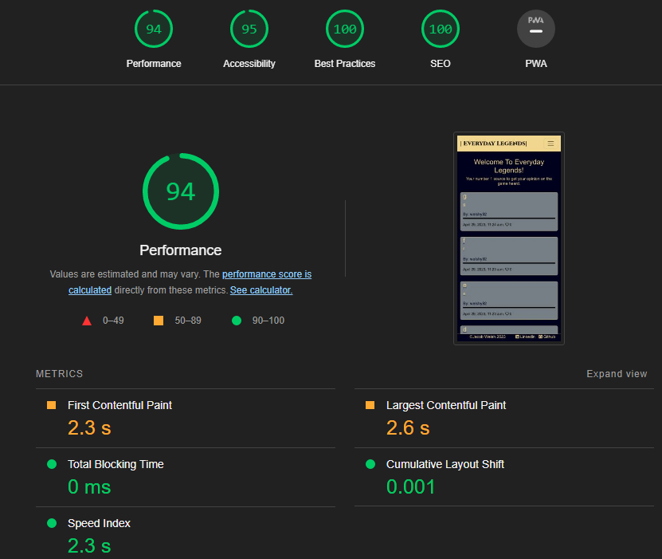

# **Everyday Legends - Testing**

 
[Everyday Legends on render.](https://everyday-legends.onrender.com)

 
## **Contents**
 
* [Back to README](../README.md)
* [Automated Testing](#automated-testing)
* [Manual Testing](#manual-testing)
* [Bugs](#bugs)

Testing was a regular occurrence during the development of this project.
 
## **Automated Testing**
 
Lighthouse tool powered by [PageSpeed Insights](https://web.dev/measure/) was used to test the performance, accessibility, best practices and SEO of the website.

CSS and HTML testing raised a lot of errors both validated using [w3c](https://www.w3.org)'s tools (100's in css due to Bootstrap5) due to the use of things such as Bootstrap5, Django and crispy forms. I will show a few of the errors below.

The same can be said with the python lint testing. No errors were thrown from the code I had written but some long line errors appeared in the settings python file as shown below.

The Javascript for sending an email through the emailjs API was verified using [JSHint](https://jshint.com). The errors claim unused and undefined variables but these are passed in from the HTML form submission.

![PEP8 results]
 
***
## **Manual Testing**
 
A full spelling and grammar check of the code + documents was completed by copying the code into Google Docs.
 
### **Full Testing**
 
Full testing was performed on my Windows 10 PC's OperaGX browser. Some other testing was performed on Google chrome and Mozilla Firefox on my Windows 11 laptop, my google chrome browser on my Android phone and my mothers Iphone (ios15) using the Safari browser.
 
#### **Validation**

I have created a video that can be viewed on youtube of a test on the features on this site. it can be viewed [HERE](https://www.youtube.com/watch?v=0aF_kpwgJCo).

In the video I do not show me going into my email inbox for security reasons but as I stated in the video, here are the pictures of the email being received.

In the video I made sure that:
* Footer links worked (opening in a separate tab).
* All renders and redirects worked correctly.
* Messages displayed when they should and displayed correctly.
* Nav bar showed correct links depending on the type of user + links working correctly.
* Main user posts model had full working CRUD functionality without using the admin panel.
* Logged in users can like or comment on posts.
* Login, Logout and registration features all work.
* Contact us form works correctly. Verified that an email has been received by checking my inbox.
* Page is responsive towards the screen size.
* Showing that creating a new champion does add an option in the user post form as well as appearing on the champion list page.
* Deleting a champion does NOT remove the user posts as it's used for 'historical purposes'
* Deleting an account also removes the posts that the user created.
* As seen in the video, some small images were not loading correctly. (Check solved bugs for my resolution to this.)
## **Bugs**
 
### **Solved Bugs**
 
* Option to logout was showing as login when already signed in. Added an if statement to the base.html navbar to see if the user was authenticated.
* Champion list link on the navbar was showing regardless of login/user status. Added an if statement to the base.html to see if the user is staff.
* MIME error appeared on the deployed Heroku app, meaning my CSS stylesheet was not being loaded. Installed django-heroku and redeployed the app on Heroku.
* Everyday Legends title in the navbar link is not working. Added the correct href.
* Making a new post (both successful and unsuccessful) rendered the next page incorrectly. Made invalid form recreate the form and a valid form now redirects to "index" which is the same as the home page.
* The pagination button was causing some whitespace on smaller screen sizes between the button and the footer. Fixed by overriding the margin size of the css class.
* Submit button in the create post was hiding behind the footer. Added a 30 pixel border at the bottom of the main-content to ensure the footer is pushed below the content.
* Liking a post was throwing up an error for incorrect attribute "user-post". Corrected to "user_post".
* Button on contact us page not applying post-btn2 css class. Reduced specificity of class as it's not required.
* *PARTIAL SOLVE* - Small icons showing the positions/roles of champions/posts were not showing correctly when debug was set to false. As they play such a tiny part to the look and feel of the post/champion pages I have removed the images entirely. Something to look at reimplementing again in the future potentially. The fix would likely require me to delete all my old files on cloudinary and recollect all the static files and I would have to be careful what I delete as I have multiple projects on that account. Lesson for the future - Use fresh cloudinary accounts for each project!

 
### **Known Bugs**
 
No other known bugs have been found upon my testing.

